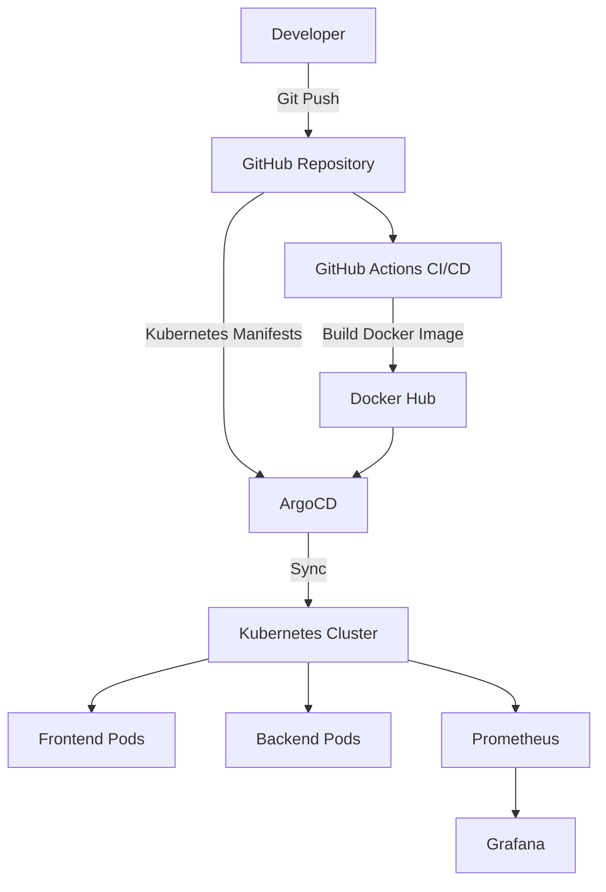

# Cloud Native GitOps Platform Architecture

## Workflow

1. Developer pushes code to GitHub.
2. GitHub Actions builds Docker images.
3. Images are pushed to Docker Hub.
4. ArgoCD monitors GitHub repository.
5. ArgoCD syncs changes to Kubernetes.
6. Kubernetes deploys new application version.
7. Prometheus collects metrics.
8. Grafana visualizes cluster health.